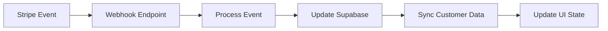

# 🔗 SaintSal Empire Webhook Setup

## Stripe Webhook Configuration

### 1. Webhook Endpoint Setup

Create a webhook endpoint in your backend API (Express.js example):

```javascript
// webhook.js
import express from "express"
import { handleStripeWebhook } from "./src/lib/stripe-service.js"

const app = express()

// Stripe webhook endpoint - MUST be raw body
app.post(
  "/webhook/stripe",
  express.raw({ type: "application/json" }),
  handleStripeWebhook
)

app.listen(3001, () => {
  console.log("Webhook server running on port 3001")
})
```

### 2. Stripe Dashboard Configuration

1. Go to [Stripe Dashboard](https://dashboard.stripe.com)
2. Navigate to **Developers > Webhooks**
3. Click **Add endpoint**
4. Set endpoint URL: `https://your-domain.com/webhook/stripe`
5. Select events to listen for:

**Required Events:**

- `customer.created`
- `customer.updated`
- `customer.subscription.created`
- `customer.subscription.updated`
- `customer.subscription.deleted`
- `invoice.payment_succeeded`
- `invoice.payment_failed`

### 3. Environment Variables

Add to your `.env` file:

```bash
# Stripe Webhook Secret (from Stripe Dashboard)
VITE_STRIPE_WEBHOOK_SECRET=whsec_your_webhook_secret_here

# Stripe API Keys
VITE_STRIPE_PUBLISHABLE_KEY=pk_test_your_publishable_key
VITE_STRIPE_SECRET_KEY=sk_test_your_secret_key

# Price IDs for your products
VITE_STRIPE_PRO_PRICE_ID=price_your_pro_price_id
VITE_STRIPE_ENTERPRISE_PRICE_ID=price_your_enterprise_price_id
```

## Supabase Integration

### 1. Database Setup

Run the SQL schema in your Supabase project:

```sql
-- Copy and paste the content from supabase-schema.sql
-- into your Supabase SQL editor and execute
```

### 2. Environment Configuration

```bash
# Supabase Configuration
VITE_SUPABASE_URL=https://your-project.supabase.co
VITE_SUPABASE_ANON_KEY=your_anon_key_here
```

### 3. Row Level Security

The schema includes RLS policies that ensure:

- Users can only access their own data
- Service role can handle webhook operations
- Secure data isolation

## AI Integration

### 1. OpenAI API Setup

```bash
# OpenAI Configuration
VITE_OPENAI_API_KEY=sk-your_openai_api_key_here
VITE_AI_API_URL=https://api.openai.com/v1
```

### 2. AI Model Configuration

The system supports:

- **SaintVision AI**: Strategic analysis (GPT-4)
- **Empire AI**: Operational commands (GPT-3.5-turbo)

Models are automatically selected based on AI type.

## Webhook Event Flow

### Customer Lifecycle

1. **User signs up** → `customer.created` → Create customer record
2. **User subscribes** → `customer.subscription.created` → Update subscription status
3. **Payment succeeds** → `invoice.payment_succeeded` → Confirm active subscription
4. **Payment fails** → `invoice.payment_failed` → Mark as past_due
5. **User cancels** → `customer.subscription.deleted` → Update to canceled

### Data Synchronization



## Testing Webhooks

### 1. Local Testing with ngrok

```bash
# Install ngrok
npm install -g ngrok

# Expose local server
ngrok http 3001

# Use the ngrok URL in Stripe webhook configuration
# https://abc123.ngrok.io/webhook/stripe
```

### 2. Stripe CLI Testing

```bash
# Install Stripe CLI
stripe listen --forward-to localhost:3001/webhook/stripe

# Test specific events
stripe trigger customer.subscription.created
stripe trigger invoice.payment_succeeded
```

## Error Handling

### Webhook Retry Logic

Stripe automatically retries failed webhooks:

- Initial attempt
- 1 hour later
- 1 day later
- 3 days later

### Monitoring

Monitor webhook events in:

1. **Stripe Dashboard** → Developers → Webhooks → Event logs
2. **Supabase** → `stripe_events` table
3. **Application logs** → Console output

## Security Best Practices

### 1. Webhook Signature Verification

```javascript
// Always verify webhook signatures
const signature = req.headers["stripe-signature"]
const event = stripe.webhooks.constructEvent(
  req.body,
  signature,
  process.env.STRIPE_WEBHOOK_SECRET
)
```

### 2. Idempotency

Handle duplicate events:

```javascript
// Check if event already processed
const existingEvent = await supabase
  .from("stripe_events")
  .select("id")
  .eq("stripe_event_id", event.id)
  .single()

if (existingEvent) {
  return res.json({ received: true, duplicate: true })
}
```

### 3. Rate Limiting

Implement rate limiting on webhook endpoints to prevent abuse.

## Troubleshooting

### Common Issues

1. **Webhook timeouts**: Ensure processing completes within 30 seconds
2. **Signature verification fails**: Check webhook secret configuration
3. **Database connection errors**: Verify Supabase credentials
4. **Missing events**: Check Stripe webhook event selection

### Debug Mode

Enable debug logging:

```bash
DEBUG=stripe:webhook,supabase:* npm start
```

## Production Deployment

### 1. HTTPS Required

Stripe requires HTTPS for webhook endpoints in production.

### 2. Load Balancing

If using multiple servers, ensure webhooks are handled consistently:

- Use sticky sessions
- Or process webhooks on a single instance
- Or use a message queue for processing

### 3. Monitoring

Set up monitoring for:

- Webhook success/failure rates
- Processing latency
- Database performance
- AI API response times

---

**🎯 Your SaintSal Empire webhook system is now ready for production!**

This setup provides:
✅ **Automatic customer sync** between Stripe and Supabase  
✅ **Real-time subscription updates** for billing changes  
✅ **Secure webhook processing** with signature verification  
✅ **Comprehensive event logging** for debugging and analytics  
✅ **Production-ready architecture** with error handling and retries
